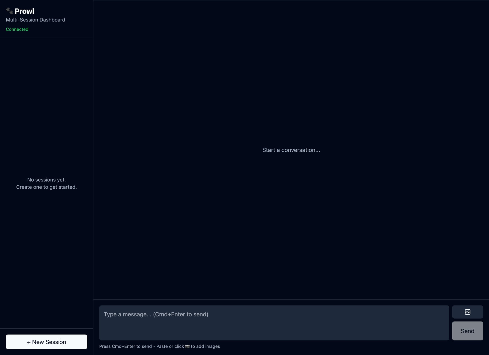

# 🐾 Prowl

**A multi-session dashboard for [OpenClaw](https://github.com/openclaw/openclaw)**

Manage multiple AI agent sessions in parallel from a single interface. Think of it as mission control for your AI workflows.



## Why Prowl?

When you're running multiple AI workstreams — research, coding, writing, automation — switching between terminal windows or chat tabs gets chaotic. Prowl gives you:

- **Multiple sessions at once** — Run parallel conversations without losing context
- **Tool call visibility** — See exactly what your agents are doing (file reads, web searches, shell commands)
- **File tracking** — Every file your agents touch is tracked and viewable
- **Real-time updates** — WebSocket connection to your OpenClaw gateway

## Features

### ✅ Working Now

- **Session Management** — Create, switch, and manage multiple sessions
- **Live Chat** — Full bidirectional messaging with markdown support
- **Tool Visualization** — Collapsible tool_use/tool_result blocks with syntax highlighting
- **File Browser** — Track all files read/written across sessions
- **File Viewer** — Click any tracked file to view its contents
- **Connection Status** — Real-time gateway connection indicator
- **Dark Mode** — Easy on the eyes for long sessions

### 🚧 Roadmap

- [ ] **Session Labels/Tags** — Organize sessions by project
- [ ] **Search** — Find messages across all sessions
- [ ] **Image Support** — View images in chat and file browser
- [ ] **Keyboard Shortcuts** — Power user navigation
- [ ] **Session Templates** — Quick-start common workflows
- [ ] **Split View** — Multiple sessions visible simultaneously
- [ ] **Export** — Download session transcripts
- [ ] **Notifications** — Desktop alerts when agents need attention
- [ ] **Token Usage** — Track costs per session
- [ ] **Mobile Responsive** — Use on tablet/phone

## Installation

### Prerequisites

- Node.js 18+
- An OpenClaw gateway running (local or remote)

### Quick Start

```bash
# Clone the repo
git clone https://github.com/openclaw/prowl.git
cd prowl

# Install dependencies
pnpm install

# Configure your gateway
cp .env.example .env
# Edit .env with your gateway URL and token

# Start the dev server
pnpm dev
```

Open http://localhost:5173

### Environment Variables

```bash
# .env
VITE_GATEWAY_URL=http://localhost:18789  # Your OpenClaw gateway
VITE_GATEWAY_TOKEN=your-token-here       # Gateway auth token
```

### Build for Production

```bash
pnpm build
pnpm preview  # Test the production build
```

The built files will be in `dist/` — serve them with any static file server.

## Architecture

```
┌─────────────────────────────────────────────────────────┐
│                      Prowl UI                           │
│  ┌──────────┐  ┌────────────────────┐  ┌─────────────┐ │
│  │ Sidebar  │  │     Chat Area      │  │ File Viewer │ │
│  │          │  │                    │  │             │ │
│  │ Sessions │  │  Messages + Tools  │  │  Contents   │ │
│  │ Files    │  │  Input Box         │  │             │ │
│  └──────────┘  └────────────────────┘  └─────────────┘ │
└─────────────────────────────────────────────────────────┘
                          │
                    WebSocket (JSON)
                          │
                          ▼
              ┌───────────────────────┐
              │   OpenClaw Gateway    │
              │                       │
              │  Sessions │ Agents    │
              │  Tools    │ Providers │
              └───────────────────────┘
```

### Tech Stack

- **React 18** — UI framework
- **TypeScript** — Type safety
- **Vite** — Build tool
- **TailwindCSS** — Styling
- **Zustand** — State management
- **react-markdown** — Message rendering

### Key Files

```
src/
├── App.tsx                 # Main layout
├── hooks/
│   ├── useGateway.ts       # WebSocket connection
│   └── useChat.ts          # Chat state management
├── stores/
│   └── appStore.ts         # Global Zustand store
├── components/
│   ├── Chat/               # Chat panel components
│   ├── Layout/             # Tab bar, chat area
│   ├── Sidebar/            # Session list, file list
│   └── FileViewer/         # File content display
└── lib/
    ├── protocol.ts         # Gateway protocol types
    ├── fileTracking.ts     # File extraction from tool calls
    └── utils.ts            # Helpers
```

## Gateway Protocol

Prowl communicates with OpenClaw via WebSocket JSON frames. Key message types:

```typescript
// Connect with auth
{ method: "auth", token: "...", client: { id: "webchat", mode: "webchat" }, scopes: [...] }

// Create session
{ method: "operator.sessions.upsert", session: { key: "session-1", kind: "isolated" } }

// Send message
{ method: "operator.sessions.chat", key: "session-1", message: "Hello" }

// Receive streaming response
{ method: "events.agent.partial", delta: "..." }
{ method: "events.agent.tool_use", tool: "Read", input: {...} }
{ method: "events.agent.done" }
```

See [OpenClaw Protocol Docs](https://docs.openclaw.ai/gateway/protocol) for the full spec.

## Contributing

PRs welcome! Some areas that need help:

- **Tests** — We have none 😅
- **Accessibility** — Screen reader support, keyboard nav
- **Theming** — Light mode, custom themes
- **Performance** — Virtual scrolling for long sessions

## License

MIT

---

Built with 🐾 by the OpenClaw community
